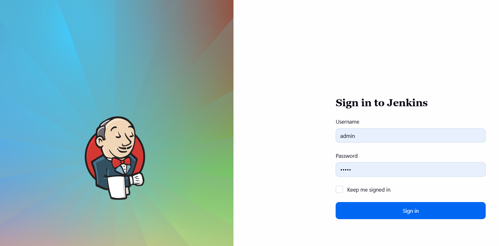
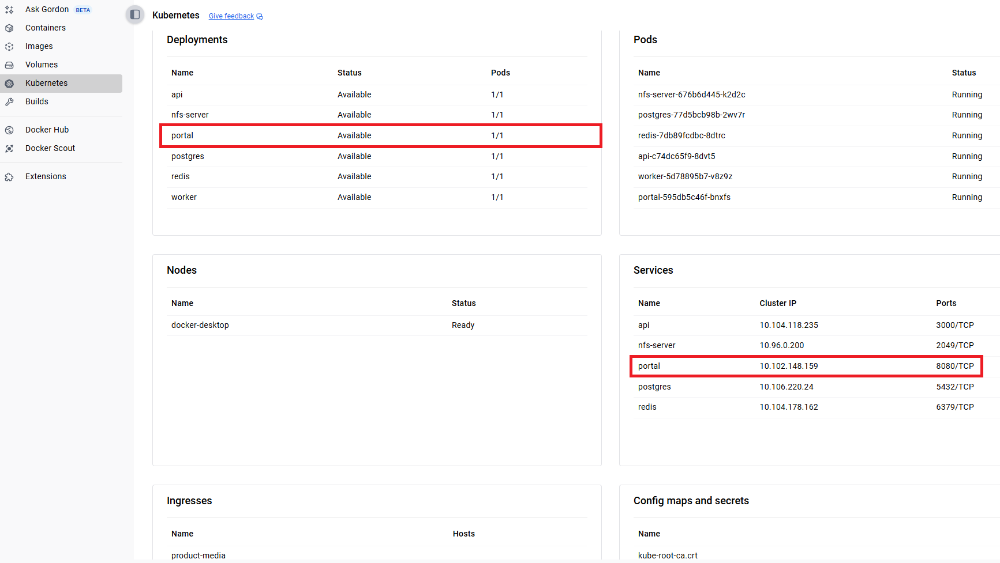
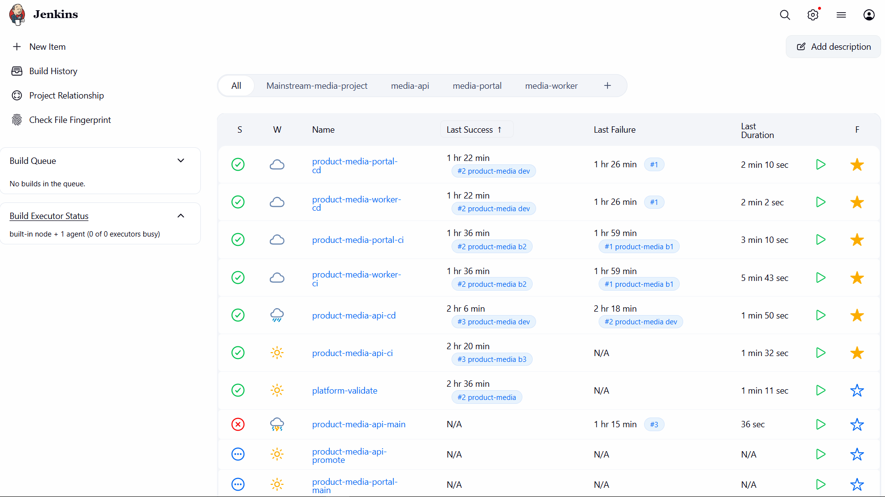
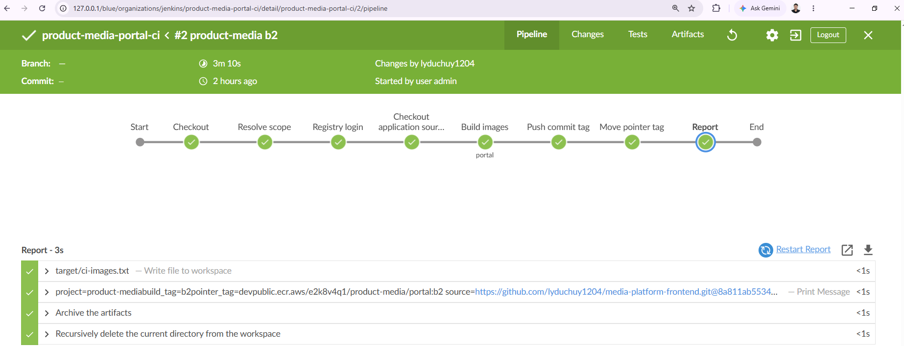
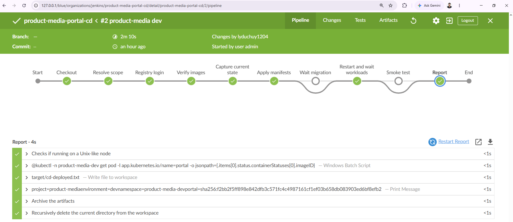

# containerized-cicd-platform

Platform CI/CD dùng chung cho nhiều project. Jenkins làm orchestrator, shared library giữ toàn bộ logic
pipeline, deploy lên Kubernetes bằng kustomize.

Ý tưởng chính: thay vì mỗi repo tự viết một Jenkinsfile riêng, toàn bộ stage nằm trong một shared library.
Thêm một security step hay đổi chiến lược rollout thì sửa một chỗ, không phải sửa 30 repository. Mỗi
service chỉ cần một Jenkinsfile mỏng gọi vào library kèm parameter.

---

## 1. Pre-condition

### 1.1 Kubernetes cluster local

Cluster single-node, bootstrap bằng **kubeadm**, chạy trên Docker Desktop.

| Thành phần | Giá trị |
| --- | --- |
| Kubernetes | `v1.34.1` (client và server) |
| Bootstrap | `kubeadm.k8s.io/v1beta4` |
| Control plane endpoint | `kubernetes.docker.internal:6443` |
| kustomize | `v5.7.1`, đã tích hợp trong kubectl |
| Container runtime | `docker://29.1.5` |

Kiểm tra trước khi bắt đầu:

```bash
kubectl version
kubectl config current-context
kubectl get nodes -o wide
kubectl -n kube-system get cm kubeadm-config -o jsonpath='{.data.ClusterConfiguration}'
```

Kết quả mong đợi:

```
Client Version: v1.34.1
Kustomize Version: v5.7.1
Server Version: v1.34.1

docker-desktop

NAME             STATUS   ROLES           VERSION   CONTAINER-RUNTIME
docker-desktop   Ready    control-plane   v1.34.1   docker://29.1.5
```

Nếu `kubectl get nodes` không trả về gì thì bật Kubernetes trong Docker Desktop Settings rồi chờ node
chuyển `Ready`.

### 1.2 Các thành phần khác

| Yêu cầu | Dùng để |
| --- | --- |
| Docker Desktop ở chế độ Linux containers | chạy Jenkins, build image |
| Python 3 | chạy `scripts/jenkins-jobs.py` |
| AWS IAM access key có quyền `ecr-public` | push image lên registry |

---

## 2. Jenkins Server local

Jenkins controller và Jenkins agent được định nghĩa trong
**[`jenkins-server/docker-compose.yml`](jenkins-server/docker-compose.yml)**. Hướng dẫn chi tiết về start,
stop, backup, nâng version nằm trong **[`jenkins-server/README.md`](jenkins-server/README.md)**.

Deploy nhanh:

```bash
cd jenkins-server
cp .env.example .env
docker compose up -d
docker compose ps
```

Đăng nhập:

| Thông tin | Giá trị |
| --- | --- |
| URL | `http://127.0.0.1/` |
| User | `admin` |
| Password | `admin` |



`JENKINS_HOME` được bind mount ra `jenkins-server/jenkins_home` nên container xoá đi dựng lại vẫn còn job,
build history và credential. Thư mục này bị gitignore vì chứa `secret.key` và `secrets/master.key`.

Lệnh trên chỉ dựng controller. Agent cần secret của node nên dựng sau, xem 6.1.

Plugin bắt buộc cho pipeline trong repo: `pipeline-groovy-lib`, `workflow-basic-steps`,
`credentials-binding`, `ws-cleanup`, `timestamper`, `pipeline-input-step`, `pipeline-build-step`, `git`.

Không cần khai báo Global Pipeline Library trong UI. Mỗi Jenkinsfile tự load library bằng step `library`
với `modernSCM` và `libraryPath: platform/pipeline-library`.

---

## 3. Structure repo

```
containerized-cicd-platform/
├── Jenkinsfile                     entrypoint của job platform-validate
│
├── jenkins-server/                 Jenkins controller + agent, chạy độc lập được
│   ├── docker-compose.yml          định nghĩa service jenkins và agent
│   ├── agent/Dockerfile            agent image: docker cli, kubectl, aws cli, git, python3
│   ├── .env.example
│   └── README.md
│
├── platform/                       lớp platform, không chứa gì riêng của project nào
│   └── pipeline-library/
│       ├── vars/                   5 pipeline
│       │   ├── validatePipeline.groovy
│       │   ├── ciPipeline.groovy
│       │   ├── cdPipeline.groovy
│       │   ├── promotePipeline.groovy
│       │   └── servicePipeline.groovy
│       └── src/com/platform/       8 class logic dùng chung
│           ├── PlatformProjects.groovy    registry khai báo project và service
│           ├── ProjectRegistry.groovy     truy vấn registry, sinh tên image/namespace/path
│           ├── ManifestPolicy.groovy      7 rule chuẩn hoá manifest
│           ├── Shell.groovy               dispatch sh hoặc bat theo isUnix
│           ├── Kubectl.groovy             apply, rollout, wait, digest
│           ├── DockerImage.groovy         login, build, push, retag, manifest
│           ├── Rollback.groovy            rollback về digest đã capture
│           └── SourceCheckout.groovy      clone source repo của từng service
│
├── projects/                       phần riêng của từng project
│   └── product-media/
│       ├── compose.yml             demo application chạy bằng docker compose
│       ├── gateway.conf            nginx gateway cho compose
│       └── services/
│           ├── api/{main,ci,promote,cd}.Jenkinsfile
│           ├── portal/{main,ci,promote,cd}.Jenkinsfile
│           └── worker/{main,ci,promote,cd}.Jenkinsfile
│
├── k8s/                            manifest, tách theo project
│   └── product-media/
│       ├── base/                   manifest gốc, không phụ thuộc môi trường
│       │   ├── config/configmap.yaml
│       │   ├── storage/{nfs-server,shared-volume}.yaml
│       │   ├── datastore/{postgres,redis}.yaml
│       │   ├── api/{deployment,service,migration-job}.yaml
│       │   ├── portal/{deployment,service}.yaml
│       │   ├── worker/deployment.yaml
│       │   └── ingress/ingress.yaml
│       └── overlays/
│           ├── dev/                namespace + image tag dev
│           ├── staging/            namespace + image tag staging
│           └── prod/               thêm hpa.yaml
│
├── scripts/
│   ├── jenkins-jobs.py             tạo node, tạo job, trigger build, đọc log qua REST API
│   ├── ecr-login.ps1               login ECR Public trên Windows agent
│   └── secret.ps1                  tạo secret database trong cluster
│
└── docs/images/                    screenshot dùng trong README
```

### Vì sao tách `vars/` và `src/`

`vars/` chỉ chứa pipeline. Jenkins map mỗi file trong `vars/` thành một global variable nên thư mục con
không được hỗ trợ, không thể nhóm helper vào đó.

`src/com/platform/` chứa toàn bộ logic, chia theo một tiêu chí duy nhất: class có gọi pipeline step hay
không.

| Nhóm | Class | Đặc điểm |
| --- | --- | --- |
| Không gọi pipeline step | `PlatformProjects`, `ProjectRegistry`, `ManifestPolicy` | static, `@NonCPS` |
| Có gọi pipeline step | `Shell`, `Kubectl`, `DockerImage`, `Rollback`, `SourceCheckout` | nhận `steps` qua constructor |

`@NonCPS` không được gọi pipeline step, nên ranh giới này là bắt buộc chứ không phải sở thích.

### Quy ước đặt tên

| Đối tượng | Quy ước | Ví dụ |
| --- | --- | --- |
| Image | `<registry>/<project>/<service>:<tag>` | `public.ecr.aws/e2k8v4q1/product-media/api:dev` |
| Namespace | `<project>-<env>` | `product-media-dev` |
| Label | `app.kubernetes.io/part-of`, `app.kubernetes.io/name` | `part-of: product-media`, `name: api` |
| Job | `<project>-<service>-<kind>` | `product-media-api-ci` |
| Build tag | `b<BUILD_NUMBER>` | `b12` |
| Pointer tag | tên môi trường | `dev`, `staging`, `prod` |

---

## 4. Quick start: hạ tầng cho project

### 4.1 Project product-media

Service media cho merchant upload ảnh và video, sinh rendition và thumbnail.

| Service | Vai trò | Source repo |
| --- | --- | --- |
| `api` | GraphQL API, nhận upload | [media-platform-backend](https://github.com/lyduchuy1204/media-platform-backend) |
| `portal` | web UI, nginx serve static | [media-platform-frontend](https://github.com/lyduchuy1204/media-platform-frontend) |
| `worker` | transcode video bằng ffmpeg | [media-platform-video-processor](https://github.com/lyduchuy1204/media-platform-video-processor) |

Source code application **không** nằm trong repo này. Stage `Checkout application sources` của CI clone
từng repo vào `.sources/<service>` rồi mới build. Repo và ref khai báo trong `PlatformProjects.groovy`.

Platform repo: [containerized-cicd-platform](https://github.com/lyduchuy1204/containerized-cicd-platform)

### 4.2 Dependency

| Dependency | Nằm ở đâu | Ghi chú |
| --- | --- | --- |
| PostgreSQL 17 | `k8s/product-media/base/datastore/postgres.yaml` | database chính |
| Redis 7 | `k8s/product-media/base/datastore/redis.yaml` | queue giữa api và worker |
| NFS server | `k8s/product-media/base/storage/nfs-server.yaml` | volume chia sẻ giữa api và worker |
| Secret `product-media-db` | tạo bằng `scripts/secret.ps1` | password database, không nằm trong git |
| ingress-nginx | cài thêm, xem 4.4 | Docker Desktop không có sẵn ingress controller |
| ECR Public | `public.ecr.aws/e2k8v4q1` | registry chứa image |

### 4.3 Tạo secret database

Chạy một lần cho mỗi namespace, trước khi deploy:

```bash
pwsh scripts/secret.ps1
```

Script sinh password random và **không ghi đè** secret đã có. Lý do: PostgreSQL khởi tạo data directory
bằng password đầu tiên, đổi password sau đó sẽ làm api không connect được.

### 4.4 Cài ingress controller

Docker Desktop không có ingress controller nên Ingress được tạo nhưng không route được. Cài
ingress-nginx:

```bash
kubectl apply -f https://raw.githubusercontent.com/kubernetes/ingress-nginx/controller-v1.11.3/deploy/static/provider/cloud/deploy.yaml
kubectl -n ingress-nginx wait --for=condition=available deploy/ingress-nginx-controller --timeout=300s
kubectl get ingressclass
```

Ingress của project route như sau:

| Path | Backend |
| --- | --- |
| `/graphql` | `api:3000` |
| `/files` | `api:3000` |
| `/healthz` | `portal:8080` |
| `/` | `portal:8080` |

### 4.5 Deploy bằng kubectl

Render và kiểm tra manifest trước:

```bash
kubectl kustomize k8s/product-media/overlays/dev
kubectl apply -k k8s/product-media/overlays/dev --dry-run=server
```

Deploy thật:

```bash
kubectl create namespace product-media-dev
kubectl apply -k k8s/product-media/overlays/dev
kubectl -n product-media-dev rollout status deploy/api
kubectl get pods -n product-media-dev
```

Kết quả mong đợi: `api`, `portal`, `worker`, `postgres`, `redis`, `nfs-server` đều `1/1 Running`, job
`api-migration` ở trạng thái `Completed`.



Cách chuẩn là deploy qua pipeline `cdPipeline`, xem mục 6. Lệnh `kubectl` ở trên dùng để kiểm tra tay.

### 4.6 Chạy bằng docker compose thay cho Kubernetes

```bash
docker compose -f projects/product-media/compose.yml up -d
docker compose -f projects/product-media/compose.yml ps
```

Stack lên gồm postgres, redis, migration, api, worker, portal và nginx gateway.
Gateway ở `http://127.0.0.1:8080`, api ở `http://127.0.0.1:3000`.

Compose này chỉ chạy application, không chạy Jenkins. Jenkins nằm ở `jenkins-server/`, xem mục 2.

### 4.7 Giới hạn của môi trường local

Chỉ chạy được **một môi trường tại một thời điểm** trên cluster local, vì PersistentVolume là
cluster-scoped và Service `nfs-server` có `clusterIP` cố định.

---

## 5. Thiết kế CI/CD

### 5.1 Kiến trúc

Ba lớp, mỗi lớp một trách nhiệm:

```
Lớp 1  Jenkinsfile mỏng      projects/product-media/services/api/ci.Jenkinsfile
       (12 file, mỗi service  ->  load library, gọi ciPipeline(project, service)
        4 file)

Lớp 2  Pipeline               platform/pipeline-library/vars/ciPipeline.groovy
       (5 file trong vars/)   ->  định nghĩa stage, parameter, options, post

Lớp 3  Logic                  platform/pipeline-library/src/com/platform/DockerImage.groovy
       (8 class trong src/)   ->  lệnh thật, không biết gì về stage
```

Mỗi service có 4 job riêng biệt nhưng dùng chung một pipeline definition. Muốn thêm service mới thì thêm
một entry vào `PlatformProjects.groovy` và 4 Jenkinsfile mỏng, không sửa library.

### 5.2 Các pipeline

| Pipeline | Vai trò | Parameter |
| --- | --- | --- |
| `validatePipeline` | gate của platform, chạy trước khi build | `PROJECT`, `SERVER_DRY_RUN` |
| `ciPipeline` | upstream: clone, build, push artifact | `PROJECT`, `SERVICE`, `POINTER_TAG`, `PUSH` |
| `promotePipeline` | downstream: dịch pointer tag, không build lại | `PROJECT`, `SERVICE`, `SOURCE_TAG`, `TARGET_TAG` |
| `cdPipeline` | downstream: rollout một môi trường | `PROJECT`, `SERVICE`, `ENVIRONMENT`, `AUTO_ROLLBACK` |
| `servicePipeline` | mainstream: điều phối 4 pipeline trên | `RUN_VALIDATE`, `DEPLOY_STAGING`, `DEPLOY_PROD` |

Stage của từng pipeline:

| Pipeline | Stage |
| --- | --- |
| `validatePipeline` | Checkout, Resolve scope, Render overlays, Check conventions, Ensure namespaces, Server dry run |
| `ciPipeline` | Checkout, Resolve scope, Registry login, Checkout application sources, Build images, Push commit tag, Move pointer tag, Report |
| `promotePipeline` | Checkout, Resolve scope, Registry login, Verify source tag, Promote, Verify same content, Report |
| `cdPipeline` | Checkout, Resolve scope, Registry login, Verify images, Capture current state, Apply manifests, Wait migration, Restart and wait workloads, Smoke test, Report |
| `servicePipeline` | Resolve scope, Validate, CI, Deploy dev, Promote staging, Deploy staging, Approve prod, Promote prod, Deploy prod |

### 5.3 Workflow

**CI (upstream)** — một commit trigger `ciPipeline`. Pipeline clone source repo của service, build image,
rồi archive artifact lên ECR. Build image của các service chạy `parallel`.

**Promote (downstream)** — dịch pointer tag của môi trường sang một build tag đã tồn tại. Không build
lại, nên artifact đi lên staging và prod đúng là artifact đã test ở dev. Stage `Verify same content` so
digest trước và sau để chứng minh nội dung không đổi.

**CD (downstream)** — lấy pointer tag của môi trường rồi rollout. Rollout theo strategy an toàn: capture
digest đang chạy trước khi apply, chờ migration job xong, `rollout restart` rồi `rollout status`, chạy
smoke test. Fail thì `post failure` gọi `Rollback.toDigests()` với digest đã capture.

**Mainstream** — `servicePipeline` gọi các job trên bằng `build job:` và chờ kết quả, có `input` approve
trước khi lên prod:

```
product-media-api-main
  │
  ├─ platform-validate                    render overlay, check convention, server dry run
  ├─ product-media-api-ci                 clone source, build, push b<n> và dev
  ├─ product-media-api-cd     dev         apply overlay, rollout restart, chờ ready
  ├─ product-media-api-promote  b<n> → staging
  ├─ product-media-api-cd     staging
  ├─ input approve                        chờ người xác nhận
  ├─ product-media-api-promote  b<n> → prod
  └─ product-media-api-cd     prod
```

### 5.4 Credentials trên Jenkins

Pipeline **không hardcode** secret và không đọc credential từ máy agent. Mọi secret lấy từ Jenkins
credentials store qua `withCredentials`, nên secret bị mask trong console log và không nằm trong git.

| Credential ID | Kind | Dùng ở đâu | Nội dung |
| --- | --- | --- | --- |
| `aws-ecr-public` | Username with password | stage `Registry login` của `ciPipeline`, `cdPipeline`, `promotePipeline` | username là `AWS_ACCESS_KEY_ID`, password là `AWS_SECRET_ACCESS_KEY` |

Credential ID được khai báo trong registry chứ không rải trong pipeline:

```groovy
defaults: [
    registry: 'public.ecr.aws/e2k8v4q1',
    registryType: 'ecr-public',
    awsRegion: 'us-east-1',
    awsCredentialsId: 'aws-ecr-public'
]
```

`DockerImage.loginEcrPublic()` bind credential thành biến môi trường rồi mới gọi `aws ecr-public
get-login-password`, nên aws CLI trên agent không cần profile cấu hình sẵn:

```groovy
steps.withCredentials([binding]) {
    runEcrLogin(region, registryHost)
}
```

Với registry thường không phải ECR thì khai báo `registryCredentialsId` và `DockerImage.login()` sẽ dùng
`docker login --password-stdin` với credential đó.

Tạo credential trong UI: **Manage Jenkins > Credentials > System > Global credentials > Add Credentials**,
chọn kind **Username with password**, ID đặt đúng `aws-ecr-public`.

### 5.5 Chiến lược tag và rollback

Mỗi lần CI push hai tag lên cùng một image:

- `b<BUILD_NUMBER>` bất biến, dùng để truy nguyên
- pointer tag `dev`, `staging` hoặc `prod`, di chuyển theo thời gian

Manifest tham chiếu pointer tag và đặt `imagePullPolicy: Always`. Hai hệ quả:

- `kubectl apply` là no-op khi chỉ đổi nội dung tag, nên `cdPipeline` phải `rollout restart`
- `kubectl rollout undo` không rollback image được vì các pod template giống nhau

Vì vậy rollback làm ở mức registry: chạy `promotePipeline` với `SOURCE_TAG` là build tag cũ và
`TARGET_TAG` là môi trường cần rollback, rồi `rollout restart`.

---

## 6. Chạy pipeline trên Jenkins Portal UI

### 6.1 Chuẩn bị job và agent

Job và node được tạo bằng REST API để cấu hình là code, không click tay:

```bash
$env:JENKINS_URL='http://127.0.0.1'
$env:JENKINS_USER='admin'
$env:JENKINS_TOKEN='<api-token>'

python scripts/jenkins-jobs.py node      # tạo node, in ra secret
python scripts/jenkins-jobs.py create    # tạo 13 job
```

Ghi secret vào `JENKINS_AGENT_SECRET` trong `jenkins-server/.env` rồi dựng agent:

```bash
cd jenkins-server
docker compose up -d --build agent
```

Vào **Manage Jenkins > Nodes**, node `executor-cluster-local` phải ở trạng thái online.

13 job được tạo:

| Job | Loại |
| --- | --- |
| `platform-validate` | gate của platform |
| `product-media-api-main`, `product-media-portal-main`, `product-media-worker-main` | mainstream |
| `product-media-<service>-ci` | upstream |
| `product-media-<service>-promote` | downstream |
| `product-media-<service>-cd` | downstream |

Dashboard được nhóm bằng View để phân biệt project và service: `Mainstream-media-project`, `media-api`,
`media-portal`, `media-worker`.



### 6.2 Chạy toàn bộ flow của một service

1. Mở `http://127.0.0.1/`, đăng nhập `admin` / `admin`.
2. Ở Dashboard, chọn job **`product-media-api-main`**.
3. Bấm **Build with Parameters** ở menu bên trái.
4. Điền parameter:

   | Parameter | Giá trị |
   | --- | --- |
   | `RUN_VALIDATE` | tích, để chạy `platform-validate` trước |
   | `DEPLOY_STAGING` | tích, để promote và deploy staging |
   | `DEPLOY_PROD` | bỏ tích ở lần chạy đầu |

5. Bấm **Build**.
6. Theo dõi ở **Stage View** trên trang job, hoặc mở build rồi chọn **Console Output**.
7. Các job downstream xuất hiện trong **Console Output** dưới dạng link, bấm vào để xem log từng job.
8. Nếu tích `DEPLOY_PROD`, build sẽ dừng ở stage **Approve prod** và hiện prompt
   `Deploy api b<n> lên prod?`. Bấm **Deploy** để tiếp tục, hoặc **Abort** để dừng.

### 6.3 Chạy riêng từng job

**Chỉ build image:** chọn job `product-media-api-ci`, bấm **Build with Parameters**.

| Parameter | Ý nghĩa |
| --- | --- |
| `PROJECT` | `product-media` |
| `SERVICE` | `api`, để trống thì build mọi service |
| `POINTER_TAG` | `dev` |
| `PUSH` | tích để push lên ECR |

**Chỉ deploy:** chọn job `product-media-api-cd`, bấm **Build with Parameters**.

| Parameter | Ý nghĩa |
| --- | --- |
| `PROJECT` | `product-media` |
| `SERVICE` | `api` |
| `ENVIRONMENT` | `dev`, `staging` hoặc `prod` |
| `AUTO_ROLLBACK` | tích để tự rollback khi rollout fail |

**Rollback:** chọn job `product-media-api-promote`, bấm **Build with Parameters**.

| Parameter | Ý nghĩa |
| --- | --- |
| `SOURCE_TAG` | build tag cũ muốn quay về, ví dụ `b11` |
| `TARGET_TAG` | môi trường cần rollback, ví dụ `prod` |

Sau đó chạy `product-media-api-cd` với đúng `ENVIRONMENT` đó để pod pull lại image.

### 6.4 Xem kết quả

| Muốn xem | Ở đâu trên UI |
| --- | --- |
| Trạng thái từng stage | trang job, bảng **Stage View** |
| Log đầy đủ | build > **Console Output** |
| Danh sách image đã build | build > **Build Artifacts** > `ci-images.txt` |
| Job downstream đã chạy | build > **Console Output**, các link `product-media-*` |
| Lịch sử build | trang job, **Build History** ở cột trái |

Plugin Blue Ocean cho view stage rõ hơn, mở bằng **Open Blue Ocean** ở menu trái.

CI của service portal, 8 stage:



CD của service portal, 10 stage:



### 6.5 Lưu ý về Restart from Stage

Jenkins cho phép **Restart from Stage** để chạy lại từ một stage giữa pipeline. Với
`product-media-<service>-main`, các stage bị bỏ qua sẽ không tính lại biến của mình. `prefix` được tính
ngay đầu pipeline nên restart từ `Deploy dev` chạy được, nhưng `buildTag` chỉ có sau stage CI, nên restart
từ `Promote staging` hay `Promote prod` sẽ báo lỗi rõ ràng thay vì trigger job sai:

```
buildTag trong, hay chay lai tu dau thay vi restart tu stage promote
```

Muốn promote một build tag cụ thể thì chạy trực tiếp job `product-media-<service>-promote` với
`SOURCE_TAG` và `TARGET_TAG`, xem 6.3.

Lưu ý: build đầu tiên sau khi cập nhật `config.xml` của job sẽ là build **không tham số**, vì POST
`config.xml` xoá các parameter definition mà Jenkins đã học từ lần build trước. Chạy một lần rồi
**Build with Parameters** sẽ xuất hiện.
