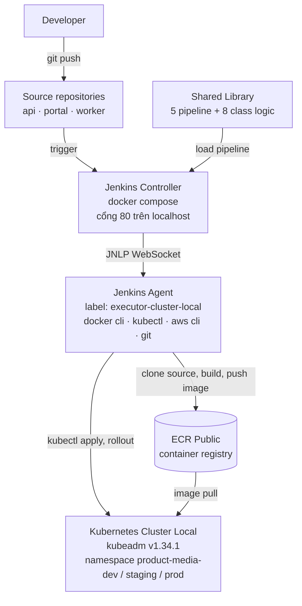
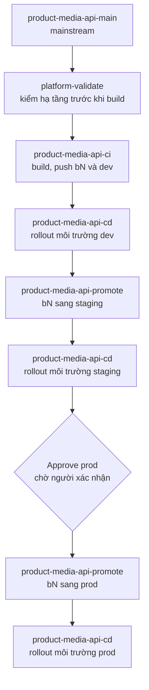

# DevOps Case Study Report

**Đề bài:** Chuẩn hoá Jenkins-based DevOps Platform cho hệ thống omni-channel e-commerce

**Repository:** [containerized-cicd-platform](https://github.com/lyduchuy1204/containerized-cicd-platform)

**Phạm vi đã làm:** Task 0 (bắt buộc) + Task 1 + Task 4

---

## Mục lục

1. [Tóm tắt cho người quản lý](#1-tóm-tắt-cho-người-quản-lý)
2. [Phạm vi và ứng dụng demo](#2-phạm-vi-và-ứng-dụng-demo)
3. [Kiến trúc hệ thống](#3-kiến-trúc-hệ-thống) — Kubernetes cluster local, Jenkins Server, Jenkins Agent
4. [Thiết kế CI/CD Pipeline](#4-thiết-kế-cicd-pipeline) — kiến trúc ba lớp, pipeline, workflow, credentials, error handling
5. [Task 0 - Kubernetes Deployment](#5-task-0---kubernetes-deployment) — resource, rolling update, cách deploy, rollback, scale, vấn đề thường gặp
6. [Task 1 - Jenkins CI/CD Pipeline](#6-task-1---jenkins-cicd-pipeline)
7. [Task 4 - Pipeline Optimization](#7-task-4---pipeline-optimization)
8. [Hướng dẫn chạy demo](#8-hướng-dẫn-chạy-demo)
9. [Troubleshooting](#9-troubleshooting)
10. [Design decisions](#10-design-decisions)
11. [Trạng thái thực tế của từng thành phần](#11-trạng-thái-thực-tế-của-từng-thành-phần)

---

## 1. Tóm tắt cho người quản lý

**Vấn đề:** mỗi project tự viết pipeline riêng. Muốn thêm một bước kiểm tra bảo mật thì phải sửa cùng một
đoạn script ở 30 repository. Deployment dễ lỗi vì không có chuẩn chung, và không ai biết version nào đang
chạy ở môi trường nào.

**Cách giải quyết:** xây một **Platform layer cho CI/CD**. Toàn bộ logic pipeline nằm trong một **Jenkins
shared library** dùng chung. Mỗi service chỉ cần một Jenkinsfile mỏng khai báo tên project và tên service.
Sửa một chỗ, mọi service được cập nhật.

| Kết quả đã chạy thật trên môi trường local | Con số |
| --- | --- |
| Pipeline dùng chung trong shared library | 5 |
| Jenkins job sinh ra từ 5 pipeline đó | 13 |
| Service được CI/CD độc lập | 3 (api, portal, worker) |
| Môi trường được mô hình hoá | 3 (dev, staging, prod) |
| Kubernetes manifest, chuẩn base/overlays | 20 file |
| Code pipeline phải viết cho mỗi service mới | khoảng 10 dòng |

**Giá trị với tổ chức:** onboard một service mới vào CI/CD giảm từ "viết một pipeline" xuống "khai báo một
entry". Mỗi lần deploy truy nguyên được về đúng commit đã build, và rollback là một lần bấm nút thay vì
build lại.

---

## 2. Phạm vi và ứng dụng demo

| Task | Trạng thái | Bằng chứng trong repo |
| --- | --- | --- |
| Task 0 - Kubernetes Deployment (bắt buộc) | Hoàn thành | thư mục **k8s**, pipeline **cdPipeline** |
| Task 1 - Jenkins CI/CD Pipeline | Hoàn thành | thư mục **platform/pipeline-library**, 13 job |
| Task 4 - Pipeline Optimization | Hoàn thành | mục 7 của báo cáo này |

Ứng dụng demo là **product-media**, service cho merchant upload ảnh và video rồi sinh rendition và
thumbnail. Gồm ba thành phần, mỗi thành phần có source repository riêng:

| Service | Vai trò | Source repository |
| --- | --- | --- |
| **api** | GraphQL API, nhận upload | [media-platform-backend](https://github.com/lyduchuy1204/media-platform-backend) |
| **portal** | Web UI, nginx serve static | [media-platform-frontend](https://github.com/lyduchuy1204/media-platform-frontend) |
| **worker** | Transcode video bằng ffmpeg | [media-platform-video-processor](https://github.com/lyduchuy1204/media-platform-video-processor) |

Source code application **không** nằm trong platform repository. Pipeline tự clone từng repo về workspace
rồi mới build. Lý do ở mục 10.

---

## 3. Kiến trúc hệ thống



Ba nguyên tắc của kiến trúc này:

1. **Controller không chạy build.** Controller chỉ điều phối, toàn bộ workload đẩy xuống agent.
2. **Logic pipeline nằm ngoài project.** Shared library là nơi duy nhất chứa stage.
3. **Registry là trung gian giữa build và deploy.** CI đẩy artifact lên registry, CD lấy từ registry xuống.
   Hai bên không phụ thuộc trực tiếp vào nhau.

### 3.1 Kubernetes cluster local (kubeadm v1.34.1)

Cluster single-node, bootstrap bằng **kubeadm**, dùng làm target deploy cho pipeline.

| Thành phần | Giá trị |
| --- | --- |
| Kubernetes version | **v1.34.1** (client và server) |
| Bootstrap | **kubeadm.k8s.io/v1beta4**, ClusterConfiguration |
| Control plane endpoint | **kubernetes.docker.internal:6443** |
| Service subnet | **10.96.0.0/12** |
| kustomize | **v5.7.1**, tích hợp sẵn trong kubectl |

```bash
kubectl version
kubectl get nodes -o wide
kubectl -n kube-system get cm kubeadm-config -o jsonpath='{.data.ClusterConfiguration}'
```

Chọn cluster local vì đề bài yêu cầu chạy được trên máy cá nhân. Manifest không phụ thuộc cloud provider,
nên cùng bộ manifest đem lên EKS hay GKE vẫn chạy, chỉ đổi StorageClass và ingress controller.

### 3.2 Jenkins Server local bằng docker compose

Controller chạy bằng **docker compose**, định nghĩa trong file **jenkins-server/docker-compose.yml**.

| Quyết định | Lý do |
| --- | --- |
| Pin version **jenkins/jenkins:2.568.3-lts-jdk21** | tránh tag **lts** đổi ngầm làm môi trường không reproducible |
| **JENKINS_HOME** bind mount ra thư mục **jenkins_home** trên host | container có thể chết hoặc bị xoá bất cứ lúc nào, nhưng job, build history, credential vẫn còn |
| **stop_grace_period** 60 giây | Jenkins cần thời gian ghi xong queue và build record; bị kill giữa lúc ghi là nguyên nhân phổ biến làm hỏng JENKINS_HOME |
| **healthcheck** gọi endpoint login | biết chính xác khi nào Jenkins sẵn sàng thay vì đoán bằng sleep |
| Port chỉ bind vào **127.0.0.1** | trước khi hoàn tất setup wizard, Jenkins chưa có security realm |

Thư mục **jenkins_home** bị gitignore vì chứa **secret.key** và **secrets/master.key**, là khoá giải mã mọi
credential. Commit lên repository public là lộ toàn bộ credential.

### 3.3 Jenkins Agent cho build và deploy

Controller không chạy build. Toàn bộ workload đẩy xuống agent, theo đúng mô hình Controller + Agents.
Agent dùng trong demo là agent native trên **Windows**, kết nối bằng JNLP WebSocket.

| Thuộc tính | Giá trị |
| --- | --- |
| Node label | **executor-cluster-local** |
| Số executor | 3, nên 3 job chạy song song |
| Mode | Exclusive, chỉ nhận job có label khớp |
| Toolchain | docker, kubectl, aws cli, git, node, python |

Vì sao agent nằm trên host Windows thay vì trong container: agent cần **build image** và **deploy vào
cluster**. Đặt trên host thì nó dùng trực tiếp Docker daemon và kubeconfig của máy, không phải xử lý
Docker-in-Docker hay việc container không giải được địa chỉ API server của cluster.

Repository cũng cung cấp sẵn một agent container đã cài đủ toolchain, dành cho máy Linux hoặc macOS. Hai
cách không chạy đồng thời vì dùng cùng một tên node. Pipeline không phụ thuộc hệ điều hành: một class
**Shell** tự chọn lệnh shell hay lệnh batch theo hệ điều hành của agent.

---

## 4. Thiết kế CI/CD Pipeline

### 4.1 Kiến trúc ba lớp và shared library

Điểm cốt lõi: **không project nào tự viết stage.**

| Lớp | Nằm ở đâu | Trách nhiệm | Số file |
| --- | --- | --- | --- |
| 1. Jenkinsfile mỏng | thư mục của từng service | khai báo project và service | 12 |
| 2. Pipeline | **platform/pipeline-library/vars** | stage, parameter, error handling | 5 |
| 3. Logic | **platform/pipeline-library/src** | lệnh thật, không biết gì về stage | 8 class |

Một Jenkinsfile của service chỉ có nội dung như sau:

```groovy
library identifier: "platform@main", retriever: modernSCM(...)

ciPipeline(project: 'product-media', service: 'api')
```

**Ý nghĩa:** thêm service mới chỉ cần một entry trong registry và 4 Jenkinsfile mỏng. Thêm một bước security
scan thì sửa một file trong library, toàn bộ service được áp dụng ngay.

Registry khai báo project nằm ở một file duy nhất là **PlatformProjects**: tên service, port, health path,
source repo, danh sách môi trường, thông tin registry. Đây là **single source of truth**, nên tên image,
namespace và job đều được sinh theo quy ước thay vì gõ tay:

```text
image      = registry / project / service : tag
             public.ecr.aws/e2k8v4q1/product-media/api:dev

namespace  = project - environment
             product-media-dev

job        = project - service - kind
             product-media-api-ci
```

### 4.2 Các pipeline và stage

| Pipeline | Vai trò | Stage chính |
| --- | --- | --- |
| **validatePipeline** | gate của platform | Render overlays, Check conventions, Ensure namespaces, Server dry run |
| **ciPipeline** | upstream: build và archive artifact | Registry login, Checkout application sources, Build images, Push commit tag, Move pointer tag |
| **promotePipeline** | downstream: promote artifact giữa các môi trường | Verify source tag, Promote, Verify same content |
| **cdPipeline** | downstream: rollout một môi trường | Verify images, Capture current state, Apply manifests, Wait migration, Restart and wait workloads, Smoke test |
| **servicePipeline** | mainstream: điều phối 4 pipeline trên | Validate, CI, Deploy dev, Promote staging, Deploy staging, Approve prod, Promote prod, Deploy prod |

Mọi pipeline đều mở đầu bằng Checkout và Resolve scope, kết thúc bằng Report ghi artifact truy nguyên.

**validatePipeline** là stage Code Quality của hạ tầng. Nó render toàn bộ overlay rồi kiểm 7 rule bắt buộc,
build fail nếu vi phạm:

| Rule | Chặn điều gì |
| --- | --- |
| không có image tag **latest** | deploy không xác định được version |
| không còn giá trị **placeholder** | overlay quên thay image tag |
| có **readOnlyRootFilesystem** | container ghi được vào root filesystem |
| có **runAsNonRoot** | container chạy bằng root |
| có **maxUnavailable 0** | rolling update làm mất service |
| có label **app.kubernetes.io/part-of** | resource không truy nguyên về project |
| có **resources.limits** | một pod có thể làm chết node |

### 4.3 Workflow upstream, downstream, mainstream

**CI (upstream).** Một commit trigger **ciPipeline**. Pipeline clone source repo của service, build container
image, rồi **archive artifact** lên ECR. Mỗi build push hai tag lên cùng một image:

- **bN** với N là build number, tag bất biến, dùng để truy nguyên về đúng build đó. Ví dụ **b12**.
- **pointer tag** của môi trường, ví dụ **dev**, di chuyển theo thời gian.

**Promote (downstream).** Đưa artifact lên staging rồi prod là **promote**, không build lại. Pipeline chỉ
dịch pointer tag sang một build tag đã tồn tại. Nhờ vậy artifact chạy ở prod đúng là artifact đã test ở dev,
không có rủi ro "build lại ra khác". Stage Verify same content so digest trước và sau để chứng minh nội
dung không đổi.

**CD (downstream).** Lấy pointer tag của môi trường rồi rollout theo strategy an toàn: capture digest đang
chạy trước khi apply, chờ migration job xong, restart rollout, chờ rollout status, chạy smoke test. Fail thì
tự rollback về digest đã capture.

**Mainstream.** Pipeline **servicePipeline** gọi các job trên theo thứ tự và chờ kết quả:



Cổng **Approve prod** chính là quy trình review và approve mà đề bài nêu là đang thiếu. Nó bắt buộc có người
xác nhận trước khi chạm vào production, và Jenkins ghi lại ai đã bấm.

### 4.4 Quản lý credentials trên Jenkins

Nguyên tắc: **pipeline không hardcode secret, và không đọc secret từ máy agent.**

| Credential ID | Kind | Dùng ở stage | Nội dung |
| --- | --- | --- | --- |
| **aws-ecr-public** | Username with password | Registry login của ciPipeline, cdPipeline, promotePipeline | username là AWS access key id, password là AWS secret access key |

Cách hoạt động: credential lưu trong **Jenkins credentials store**, được mã hoá bằng master key của
Jenkins. Pipeline không biết giá trị, nó chỉ biết **ID**, và ID đó khai báo trong registry:

```groovy
defaults: [
    registry: 'public.ecr.aws/e2k8v4q1',
    registryType: 'ecr-public',
    awsRegion: 'us-east-1',
    awsCredentialsId: 'aws-ecr-public'
]
```

Đến stage Registry login, pipeline dùng **withCredentials** bind credential thành biến môi trường chỉ tồn
tại trong block đó, rồi mới gọi lệnh lấy token của registry. Ba lợi ích:

- **Secret bị mask trong log.** Build log thật in ra dòng thông báo đã mask giá trị secret access key, giá
  trị không bao giờ xuất hiện.
- **Secret không nằm trong git.** Chỉ có ID nằm trong code.
- **Rotate được không cần sửa code.** Đổi giá trị credential trên Jenkins là xong.

Mở rộng cho nhiều môi trường: mỗi môi trường khai báo một credential ID riêng trong registry, pipeline
không đổi. Đây là cách tách **secrets management** khỏi **pipeline logic**.

### 4.5 Error handling và parallel build

| Cơ chế | Cách làm | Mục đích |
| --- | --- | --- |
| Parallel build | stage Build images build nhiều service song song | thời gian bằng service chậm nhất thay vì tổng |
| Fail fast | stage Verify images kiểm image tồn tại trên registry trước khi apply | không deploy một tag không tồn tại |
| Retry có giới hạn | lệnh push image retry 3 lần, cách nhau 15 giây | chịu được lỗi mạng tạm thời |
| Log khi fail | stage Wait migration fail thì tự in log của migration job | không phải vào cluster tìm log thủ công |
| Auto rollback | block post failure rollback về digest đã capture | môi trường không nằm ở trạng thái nửa vời |
| Chống chạy chồng | disableConcurrentBuilds | hai build không cùng deploy một namespace |
| Cleanup và timeout | xoá workspace sau mỗi build, timeout trên mọi pipeline | workspace không phình, build treo không giữ executor mãi |

---

## 5. Task 0 - Kubernetes Deployment

### 5.1 Resource đã tạo

Manifest chia theo mô hình **base/overlays** của kustomize:

```text
k8s/product-media/
├── base/          Deployment, Service, ConfigMap, Ingress, migration Job,
│                  postgres, redis, nfs-server, PersistentVolume + Claim
└── overlays/
    ├── dev/       namespace + image tag dev
    ├── staging/   namespace + image tag staging
    └── prod/      namespace + image tag prod + HorizontalPodAutoscaler
```

Thư mục **base** chứa phần chung, **overlays** chỉ chứa phần **khác nhau** giữa các môi trường. Đây là cách
chống **config drift**: không thể có tình trạng dev sửa một thứ mà staging quên sửa theo, vì cả hai đọc cùng
một base.

### 5.2 Config, image versioning và rolling update

| Yêu cầu | Cách làm |
| --- | --- |
| Environment variables và config | ConfigMap cho config thường, Secret cho connection string của database, container nạp bằng envFrom và secretKeyRef |
| Image versioning | tag **bN** bất biến cho mỗi build, với N là build number, cộng pointer tag theo môi trường. Không dùng tag **latest**, và validatePipeline chặn tag này |
| Rolling update | strategy RollingUpdate với **maxUnavailable 0** và **maxSurge 1** |
| Health check | startupProbe, readinessProbe, livenessProbe đầy đủ |
| Resource | requests và limits cho cpu, memory, ephemeral-storage |
| Bảo mật container | runAsNonRoot, readOnlyRootFilesystem, drop toàn bộ capabilities |

**maxUnavailable 0** là điểm quan trọng: Kubernetes phải tạo pod mới và chờ nó **pass readiness** trước khi
xoá pod cũ, nghĩa là zero-downtime deployment. Nếu image mới lỗi, pod mới không bao giờ ready, pod cũ vẫn
phục vụ traffic, và rollout tự timeout.

### 5.3 Cách deploy: kubectl apply với kustomize

Pipeline deploy bằng **kubectl apply** trên một kustomize overlay. Bốn lý do chọn cách này:

**1. Không thêm dependency.** kustomize đã tích hợp trong kubectl từ bản 1.14, nên agent chỉ cần một
binary. Ít thành phần phải cài và phải nâng version là ít thứ có thể vỡ.

**2. Manifest vẫn là YAML thật.** Một pull request đổi config là một diff trên YAML mà reviewer đọc được
ngay, không phải tự render template trong đầu để biết kết quả. Với một platform mà nhiều team cùng sửa, khả
năng review được là yếu tố quyết định.

**3. Xem trước được kết quả apply.** Lệnh **kubectl kustomize** render ra manifest cuối cùng, và
**kubectl apply --dry-run=server** cho API server validate mà không thay đổi gì. Cả hai đều chạy trong
validatePipeline, nên lỗi cấu hình bị chặn ở CI chứ không phát hiện lúc deploy.

**4. Đổi image tag là một thao tác.** Mỗi overlay khai báo image tag của môi trường đó qua trường
**images.newTag**. Không cần thiết kế thêm một lớp biến trung gian.

Bản chất của mô hình base/overlays là **khai báo sự khác biệt thay vì lặp lại toàn bộ**. Ba môi trường dùng
chung một base; overlay của dev chỉ khai báo namespace và image tag của dev. Muốn thêm môi trường thứ tư
thì thêm một overlay khoảng 12 dòng, không copy manifest.

### 5.4 Cách rollback khi deployment lỗi

Ba lớp, từ tự động đến thủ công:

| Lớp | Cách làm | Khi nào dùng |
| --- | --- | --- |
| 1. Auto rollback trong pipeline | cdPipeline capture digest đang chạy trước khi apply; block post failure tự deploy lại đúng digest đó | rollout fail hoặc smoke test fail, không cần người can thiệp |
| 2. Rollback ở mức registry | chạy promotePipeline với source tag là build tag cũ, ví dụ b11, rồi chạy lại cdPipeline | phát hiện lỗi sau khi deploy đã thành công. Mọi build tag còn trên registry nên quay về version nào cũng chỉ là một lần bấm nút |
| 3. Rollback bằng Kubernetes | revisionHistoryLimit giữ 3 revision gần nhất | khi pod template thực sự khác nhau |

Một chi tiết kỹ thuật: vì manifest tham chiếu **pointer tag** thay vì tag bất biến, hai pod template trước
và sau deploy giống nhau từng ký tự. Hệ quả là kubectl apply không thấy gì thay đổi và lệnh rollout undo
không đổi được image. Đó là lý do cdPipeline phải dùng **rollout restart** cộng **imagePullPolicy Always**,
và lý do rollback được làm ở mức registry thay vì dựa vào rollout undo.

### 5.5 Cách scale application

| Mức | Cách làm | Đã có |
| --- | --- | --- |
| Thủ công | đổi số replicas trong overlay của môi trường | có |
| Tự động theo CPU | HorizontalPodAutoscaler | có ở overlay prod: api 2-6 replica, portal 2-4 replica, target CPU 70% |
| Phân bố pod | podAntiAffinity ưu tiên rải pod ra các node khác nhau | có |
| Theo metric nghiệp vụ | HPA với custom metric, ví dụ độ dài queue Redis cho worker | chưa; phù hợp với worker vì workload phụ thuộc queue chứ không phụ thuộc CPU |
| Mức node | Cluster Autoscaler hoặc Karpenter | không áp dụng với cluster local single-node |

Điều kiện để HPA hoạt động: pod phải khai báo **resources.requests** (đã có, và validatePipeline bắt buộc),
và cluster phải có **metrics-server**.

### 5.6 Các vấn đề thường gặp khi deploy K8s

| Vấn đề | Nguyên nhân và cách xử lý |
| --- | --- |
| Dùng image tag **latest** | rollback không xác định được version. Dùng tag bất biến; validatePipeline chặn ngay ở CI |
| **CreateContainerConfigError** | thiếu ConfigMap hoặc Secret. Đã gặp thật, xem mục 9 |
| **ImagePullBackOff** | sai tên image, chưa push, hoặc thiếu credential registry. cdPipeline chặn sớm bằng stage Verify images |
| Pod bị **OOMKilled** | limits memory quá thấp hoặc application leak |
| Thiếu probe | traffic vào pod chưa sẵn sàng. Khai báo đủ startup, readiness, liveness |
| Rolling update làm mất service | đặt maxUnavailable 0 cộng readinessProbe đúng |
| Không có resource limit | một pod làm chết node. requests và limits bắt buộc, kiểm bằng validatePipeline |
| Config drift giữa các môi trường | dùng base/overlays, không copy manifest giữa các env |
| Migration chạy song song làm hỏng schema | migration là Job riêng, cdPipeline chờ Job xong mới rollout workload |
| PersistentVolume không giải phóng | PV là resource cluster-scoped, cần tách theo môi trường hoặc dùng dynamic provisioning |

---

## 6. Task 1 - Jenkins CI/CD Pipeline

Ba điểm đề bài hỏi, tổng hợp từ mục 4 và 5.4.

**Pipeline structure.** Ba lớp: Jenkinsfile mỏng, pipeline trong thư mục **vars**, logic trong thư mục
**src**. Tiêu chí tách: **vars** chỉ chứa pipeline vì Jenkins map mỗi file trong đó thành một global
variable và không hỗ trợ thư mục con. **src** chứa logic, chia tiếp theo một tiêu chí duy nhất là class có
gọi pipeline step hay không. Class không gọi step thì để static cho nhẹ; class có gọi step thì nhận đối
tượng steps qua constructor. Ranh giới này bắt buộc vì phương thức được đánh dấu NonCPS không được gọi
pipeline step.

**Rollback.** Ba lớp ở mục 5.4: auto rollback về digest trong block post failure, rollback ở mức registry
bằng promotePipeline, và rollout undo của Kubernetes.

**Xử lý failure.** Bảng cơ chế ở mục 4.5. Nguyên tắc chung là **fail sớm và fail rõ**: kiểm điều kiện trước
khi làm việc tốn thời gian, in đúng log cần thiết khi fail, và không để môi trường ở trạng thái nửa vời.

---

## 7. Task 4 - Pipeline Optimization

**Scenario:** build mất 25 phút, Docker build thường fail, developer phàn nàn deployment chậm.

### 7.1 Phân tích nguyên nhân

Trước khi tối ưu phải biết 25 phút đó đi đâu. Cách làm: bật timestamp trên pipeline rồi đọc thời gian từng
stage, thay vì đoán.

| Nguyên nhân thường gặp | Vì sao gây chậm |
| --- | --- |
| Không có dependency cache | mỗi build tải lại toàn bộ package từ internet |
| Dockerfile sai thứ tự layer | copy source trước khi install dependency, nên mọi thay đổi code đều invalidate cache của layer install |
| Build lại ở mỗi môi trường | cùng một commit bị build 3 lần cho dev, staging, prod |
| Stage chạy tuần tự | test và lint không phụ thuộc nhau nhưng vẫn chờ nhau |
| Build chạy trên controller | một executor, các build xếp hàng |

Riêng "Docker build thường fail" thường không phải lỗi Dockerfile mà là **lỗi mạng tạm thời** khi pull base
image hoặc push layer. Loại lỗi này biểu hiện giống nhau nhưng cách xử lý hoàn toàn khác: sửa Dockerfile
không giúp gì, cần retry.

### 7.2 Sáu cách tối ưu và trạng thái trong repo

| # | Giải pháp | Đã áp dụng |
| --- | --- | --- |
| 1 | **Artifact reuse thay vì rebuild.** Build một lần, promote artifact giữa các môi trường bằng cách dịch pointer tag. Cắt hẳn 2 trong 3 lần build | Có, promotePipeline |
| 2 | **Parallel stages.** Build nhiều service cùng lúc, thời gian bằng service chậm nhất thay vì tổng | Có, stage Build images |
| 3 | **Retry cho lỗi mạng.** Lệnh push image retry 3 lần cách nhau 15 giây thay vì fail cả build | Có, class DockerImage |
| 4 | **Scale agent theo label.** Controller không chạy build, thêm agent là thêm throughput; agent có 3 executor | Có |
| 5 | **Dependency cache và Dockerfile multi-stage.** Copy file khai báo dependency và install trước khi copy source, để layer dependency chỉ rebuild khi dependency thật sự đổi | Có ở Dockerfile của từng service |
| 6 | **Fail sớm.** validatePipeline và stage Verify images chặn trước khi tới các stage tốn thời gian | Có |

---

## 8. Hướng dẫn chạy demo

Điều kiện: Kubernetes cluster local đang chạy, Docker ở chế độ Linux containers, cổng 80 còn trống, và một
AWS IAM access key có quyền với ECR Public.

**Bước 1 - Dựng Jenkins controller.**

```bash
git clone https://github.com/lyduchuy1204/containerized-cicd-platform.git
cd containerized-cicd-platform/jenkins-server
cp .env.example .env
docker compose up -d jenkins
docker compose ps
```

Chờ healthcheck chuyển sang healthy, lần đầu mất vài phút vì Jenkins giải nén war. Mở Jenkins ở cổng 80 trên
localhost, lấy mật khẩu initial admin rồi hoàn tất setup wizard:

```bash
docker compose exec jenkins cat /var/jenkins_home/secrets/initialAdminPassword
```

Danh sách plugin bắt buộc có trong README của repository.

**Bước 2 - Kết nối agent.** Vào **Manage Jenkins > Nodes > New Node**, tạo Permanent Agent với Name
**executor-cluster-local**, 3 executor, Remote root directory trên ổ đĩa của agent, Label
**executor-cluster-local**, Usage "Only build jobs with label expressions matching this node", Launch method
"Launch agent by connecting it to the controller". Mở trang node, lấy secret rồi chạy trên máy agent:

```bash
curl.exe -sO http://127.0.0.1:80/jnlpJars/agent.jar
java -jar agent.jar -url http://127.0.0.1:80/ -secret THE_SECRET -name "executor-cluster-local" -webSocket -workDir "c:\jenkins"
```

**Bước 3 - Tạo credential cho registry.** Vào **Manage Jenkins > Credentials > System > Global credentials >
Add Credentials**, chọn kind **Username with password**, ID đặt đúng **aws-ecr-public**, Username là AWS
access key id, Password là AWS secret access key.

**Bước 4 - Tạo secret của database trong cluster.**

```bash
pwsh scripts/secret.ps1
```

Script sinh password random và không ghi đè secret đã có, vì PostgreSQL khởi tạo data directory bằng
password đầu tiên.

**Bước 5 - Tạo job.** Tạo job kiểu **Pipeline**, phần Definition chọn **Pipeline script from SCM**, trỏ vào
repository này và điền Script Path theo quy ước:

| Job | Script Path |
| --- | --- |
| platform-validate | Jenkinsfile |
| product-media-SERVICE-KIND | projects/product-media/services/SERVICE/KIND.Jenkinsfile |

Với SERVICE thuộc api, portal, worker và KIND thuộc ci, cd, promote, main, tổng cộng 13 job. Không cần khai
báo Global Pipeline Library trên UI: mỗi Jenkinsfile tự load shared library bằng step library.

**Bước 6 - Chạy pipeline.** Mở job **product-media-api-main**, bấm **Build with Parameters**, tích
RUN_VALIDATE và DEPLOY_STAGING, bỏ tích DEPLOY_PROD ở lần chạy đầu, rồi bấm **Build**. Theo dõi ở
**Stage View** hoặc **Console Output**. Kiểm kết quả:

```bash
kubectl get pods -n product-media-dev
kubectl -n product-media-dev rollout status deploy/api
```

Mong đợi api, portal, worker, postgres, redis, nfs-server đều ở trạng thái Running và job api-migration ở
trạng thái Completed.

Muốn chạy application bằng Docker thay cho Kubernetes:

```bash
docker compose -f projects/product-media/compose.yml up -d
```

Gateway lên ở cổng 8080, api ở cổng 3000.

---

## 9. Troubleshooting

Các sự cố dưới đây gặp thật trong quá trình xây dựng.

**1. Pod api-migration ở trạng thái CreateContainerConfigError.** Thiếu Secret của database trong namespace.
Bài học: manifest tham chiếu Secret thì Secret phải là bước bootstrap riêng, không nằm trong kustomize, vì
nó chứa giá trị không được commit. Cách xử lý: một script tạo Secret một lần cho mỗi namespace, idempotent
và không ghi đè, vì PostgreSQL khởi tạo data directory bằng password đầu tiên nên đổi password sau đó sẽ làm
api không connect được.

**2. Đăng nhập registry thất bại trên Windows.** Token của ECR Public dài 2772 byte, vượt giới hạn 2560 byte
của Windows Credential Manager. Triệu chứng gây nhầm lẫn: xác thực thành công rồi mới chết ở bước lưu
credential. Cách xử lý: ghi thẳng file config của Docker vào một thư mục riêng trong workspace rồi trỏ
Docker vào thư mục đó, bỏ qua credential helper của hệ điều hành.

**3. Push image đứt với lỗi "use of closed network connection".** Không phải lỗi Dockerfile mà là proxy của
Docker Desktop cắt kết nối sau khi treo vài phút. Cách xử lý: retry 3 lần cách nhau 15 giây, và tắt
provenance attestation khi build để giảm số round-trip lên registry.

**4. Lệnh rollout undo không rollback được image.** Vì manifest dùng pointer tag, pod template trước và sau
deploy giống nhau nên Kubernetes coi là không có gì đổi. Cách xử lý: dùng rollout restart cộng
imagePullPolicy Always, và rollback ở mức registry, xem mục 5.4.

**5. Lệnh kubectl với jsonpath trả exit code 1 khi danh sách rỗng.** Không trả về chuỗi rỗng mà fail hẳn,
làm pipeline dừng. Cách xử lý: bọc try/catch trong class Kubectl và coi kết quả rỗng là trạng thái hợp lệ,
nghĩa là workload chưa từng được deploy.

**6. Restart from Stage làm pipeline mainstream fail vì tên job downstream bị ghép sai.** Khi restart từ
stage giữa, các stage phía trước bị skip nên biến của chúng còn rỗng. Cách xử lý: tính những giá trị chỉ phụ
thuộc cấu hình ngay đầu pipeline, còn giá trị phụ thuộc runtime thì kiểm tra rồi báo lỗi rõ ràng thay vì
trigger job sai.

**Cách debug một production issue.** Thứ tự nên đi: xem rollout status và describe pod để biết deployment có
thành công không; đọc log của container đã chết bằng tuỳ chọn previous; so digest đang chạy với digest kỳ
vọng để biết đúng version đã lên chưa; xem metric CPU và memory so với limits để loại trừ OOM và throttling.
Nếu chưa tìm ra trong thời gian chấp nhận được thì **rollback trước, điều tra sau**, vì khôi phục dịch vụ ưu
tiên hơn tìm root cause.

---

## 10. Design decisions

| # | Quyết định | Phương án bị loại | Lý do |
| --- | --- | --- | --- |
| 1 | Shared library giữ toàn bộ logic, Jenkinsfile của service chỉ khai báo | mỗi repo tự viết Jenkinsfile đầy đủ | sửa một chỗ áp dụng cho mọi service; đây chính là vấn đề đề bài nêu |
| 2 | Source code application ở repository riêng, pipeline tự clone | đưa source vào platform repo | platform repo là hạ tầng, không phải nơi chứa code sản phẩm |
| 3 | kubectl apply với kustomize theo mô hình base/overlays | copy manifest riêng cho từng môi trường | khai báo sự khác biệt thay vì lặp lại toàn bộ, chống config drift. Xem mục 5.3 |
| 4 | Một pipeline riêng cho từng service, dùng chung definition | một pipeline build cả project | mỗi service deploy độc lập, không phải chờ service khác |
| 5 | Pointer tag theo môi trường cộng build tag bất biến | chỉ dùng git commit SHA | manifest không phải sửa mỗi lần deploy, vẫn truy nguyên được qua build tag. Đánh đổi: phải dùng rollout restart |
| 6 | Promote artifact thay vì rebuild cho từng môi trường | build lại ở mỗi môi trường | artifact lên prod đúng là artifact đã test, đồng thời cắt 2 trong 3 lần build |
| 7 | Chuẩn manifest được enforce bằng CI | viết tài liệu quy ước | tài liệu không ai đọc, CI thì fail build. 7 rule ở mục 4.2 |
| 8 | Credential lưu trong Jenkins credentials store | đọc từ profile cấu hình sẵn trên máy agent | secret được mask trong log, rotate không cần sửa code, agent không cần cấu hình sẵn |
| 9 | Job dùng Pipeline script from SCM | pipeline script inline trên UI | pipeline là code, có review và có lịch sử |
| 10 | Controller không chạy build | build ngay trên controller | tách workload khỏi controller là điều kiện để scale agent và để controller ổn định |
| 11 | Agent nằm trên host thay vì trong container | Docker-in-Docker | tránh vấn đề quyền của Docker-in-Docker, và việc container không giải được địa chỉ API server của cluster local |
| 12 | Migration là Job riêng, CD chờ Job xong | migration trong initContainer của mỗi pod | nhiều replica sẽ chạy migration song song và làm hỏng schema |

---

## 11. Trạng thái thực tế của từng thành phần

Theo yêu cầu của đề bài, phần này ghi rõ cái gì chạy thật và cái gì được đơn giản hoá.

| Thành phần | Trạng thái | Ghi chú |
| --- | --- | --- |
| Build và push container image | **Thật** | image thật trên ECR Public, có digest |
| Deploy lên Kubernetes | **Thật** | pod thật chạy trên cluster kubeadm v1.34.1 |
| Database migration | **Thật** | Kubernetes Job, CD chờ hoàn tất |
| Promote giữa các môi trường | **Thật** | dịch tag trên registry, có verify digest |
| Cổng approve production | **Thật** | Jenkins ghi lại ai approve |
| Auto rollback khi rollout fail | **Thật** | rollback về digest đã capture trước khi apply |
| Ba môi trường dev, staging, prod | **Mô hình hoá đầy đủ, chạy lần lượt** | overlay và namespace tách riêng thật, nhưng cluster local chỉ chạy được một môi trường tại một thời điểm vì PersistentVolume là resource cluster-scoped. Trên cluster thật, ba môi trường chạy song song không cần sửa manifest |
| Smoke test sau deploy | **Có cơ chế, chưa cấu hình lệnh** | cdPipeline có stage Smoke test, lệnh khai báo qua registry |
| Monitoring và alerting | **Chưa triển khai** | không thuộc 3 task đã chọn |
| Code Quality và SAST | **Chưa triển khai** | không thuộc danh sách stage bắt buộc của đề bài. Vị trí đúng để cắm vào là downstream của CI: SonarQube cho SAST, và DAST scan trên endpoint đã provision ở staging |

**Hướng phát triển tiếp theo:** thêm SonarQube vào downstream của CI, cài Prometheus và Grafana cho
monitoring Jenkins và application, và chuyển cấu hình Jenkins sang Configuration as Code kèm pin version
plugin để bản thân controller cũng reproducible.
