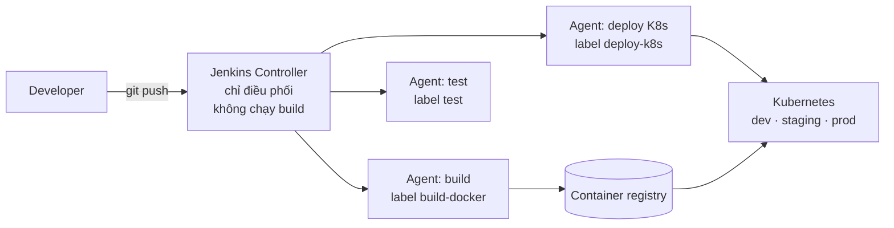
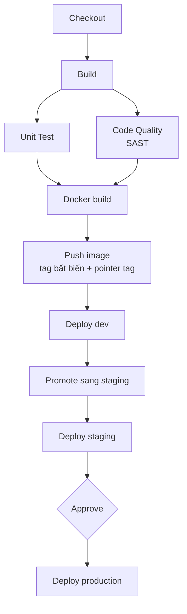

# Chuẩn hoá Jenkins-based DevOps Platform

**Slide deck - 8 slide, trình bày 10 phút**

Ứng viên: Lý Đức Huy · Vị trí: DevOps Engineer

Repository demo: [containerized-cicd-platform](https://github.com/lyduchuy1204/containerized-cicd-platform)

| Slide | Nội dung | Thời lượng |
| --- | --- | --- |
| 1 | Bối cảnh và mục tiêu | 1 phút |
| 2 | Jenkins architecture: Controller + Agents | 1 phút |
| 3 | Pipeline template và quy trình PR, review, approve | 1,5 phút |
| 4 | Quản lý secrets và environments | 1 phút |
| 5 | Pipeline design end-to-end | 2 phút |
| 6 | Deployment strategy và rollback | 1,5 phút |
| 7 | Reliability và scalability | 1 phút |
| 8 | Monitoring, alerting và DevOps metrics | 1 phút |

---

## Slide 1 - Bối cảnh và mục tiêu

**Hiện trạng**

- CI/CD không đồng nhất giữa các project, mỗi repo một kiểu
- Build time lâu, deployment dễ lỗi
- Chưa có pipeline template chung
- Chưa có quy trình PR, review, approve rõ ràng

**Vấn đề gốc:** logic pipeline bị copy ra nhiều nơi. Thêm một bước kiểm tra bảo mật là phải sửa 30 repository.

**Mục tiêu:** một platform CI/CD dùng chung. Sửa một chỗ, mọi project được cập nhật.

> Điểm nhấn: không nói về công cụ trước, nói về nguyên nhân trước. Mọi giải pháp phía sau đều nhắm vào
> nguyên nhân này.

---

## Slide 2 - Jenkins architecture: Controller + Agents



| Nguyên tắc | Lý do |
| --- | --- |
| Controller không chạy build | build nặng làm controller chậm và dễ chết, kéo cả tổ chức theo |
| Agent tách theo **label** | job chạy đúng máy có đủ toolchain |
| Agent chủ động kết nối vào controller | không cần mở port vào máy agent |

> Điểm nhấn: đây là điều kiện tiên quyết để scale. Không tách được build khỏi controller thì không thêm
> throughput được.

---

## Slide 3 - Pipeline template và quy trình PR, review, approve

**Shared library là nơi duy nhất chứa logic**

```
Lớp 1   Jenkinsfile mỏng trong repo service   khai báo tên project và service
Lớp 2   Pipeline trong shared library         định nghĩa stage, parameter, error handling
Lớp 3   Class logic trong shared library      lệnh thật, không biết gì về stage
```

Một service chỉ cần khoảng 10 dòng Jenkinsfile. Thêm một security scan thì sửa một file trong library.

**Quy trình PR, review, approve**

| Cổng | Cơ chế |
| --- | --- |
| Code vào nhánh chính | pull request, bắt buộc review, pipeline phải xanh mới merge được |
| Hạ tầng lên môi trường | job validate chặn trước khi build nếu manifest sai chuẩn |
| Lên production | cổng approve trong pipeline, Jenkins ghi lại ai bấm |

> Điểm nhấn: chuẩn hoá không phải viết tài liệu quy ước. Chuẩn hoá là làm cho việc sai trở nên không thể
> merge được.

---

## Slide 4 - Quản lý secrets và environments

**Secrets**

- Secret nằm trong Jenkins credentials store, được mã hoá, không nằm trong git
- Pipeline chỉ biết **ID** của credential, không biết giá trị
- Bind bằng withCredentials, chỉ tồn tại trong đúng stage cần dùng, và bị mask trong log
- Rotate secret không cần sửa code

**Environments**

| Nguyên tắc | Cách làm |
| --- | --- |
| Khai báo sự khác biệt, không lặp lại | manifest theo mô hình base và overlays |
| Mỗi môi trường một namespace | namespace theo mẫu project trừ môi trường |
| Mỗi môi trường một credential ID | pipeline không đổi, chỉ đổi tham số |

> Điểm nhấn: dev, staging, prod đọc cùng một base. Đó là cách chống config drift ngay từ thiết kế, không
> phải bằng kỷ luật con người.

---

## Slide 5 - Pipeline design end-to-end



| Nhóm | Tool |
| --- | --- |
| Orchestration | Jenkins, shared library |
| Build và artifact | Docker, container registry |
| Chất lượng và bảo mật | unit test, SonarQube cho SAST, DAST trên staging |
| Deploy | kubectl với kustomize |

**Hai điểm thiết kế quan trọng**

- **Test và Code Quality chạy song song.** Không phụ thuộc nhau thì không chờ nhau.
- **Promote, không build lại.** Artifact lên production đúng là artifact đã test ở dev.

> Điểm nhấn: mỗi image có một tag bất biến theo build number, cộng một pointer tag theo môi trường. Nhờ vậy
> luôn trả lời được câu hỏi "production đang chạy commit nào".

---

## Slide 6 - Deployment strategy và rollback

**Deployment strategy**

- Rolling update với **maxUnavailable 0**: pod mới phải pass readiness trước khi pod cũ bị xoá
- Health check đầy đủ: startup, readiness, liveness
- Database migration là job riêng, deploy chờ migration xong mới rollout
- Image mới lỗi thì pod mới không bao giờ ready, pod cũ vẫn phục vụ traffic

**Rollback ba lớp**

| Lớp | Cách làm | Thời gian |
| --- | --- | --- |
| 1. Tự động | pipeline capture version đang chạy trước khi deploy, fail thì tự đưa về version đó | không cần người |
| 2. Qua registry | promote pointer tag về build tag cũ rồi rollout lại | một lần bấm nút |
| 3. Qua Kubernetes | rollout undo về revision trước | khi pod template khác nhau |

> Điểm nhấn: rollback nhanh vì mọi build tag cũ vẫn còn trên registry, nên quay về version nào cũng không
> phải build lại.

---

## Slide 7 - Reliability và scalability

| Vấn đề | Giải pháp | Kết quả |
| --- | --- | --- |
| Build xếp hàng | thêm agent theo label, mỗi agent nhiều executor | throughput tăng theo số agent |
| Peak giờ cao điểm | dynamic agent trên Kubernetes, tạo pod theo nhu cầu rồi xoá | trả tiền theo lúc dùng |
| Stage chờ nhau vô ích | chạy parallel các stage độc lập | thời gian bằng nhánh chậm nhất |
| Tải lại dependency mỗi build | dependency cache, Dockerfile đúng thứ tự layer | layer install chỉ rebuild khi dependency đổi |
| Build lại cho từng môi trường | artifact reuse, build một lần rồi promote | cắt 2 trong 3 lần build |
| Docker build hay fail | phần lớn là lỗi mạng tạm thời, cần retry chứ không phải sửa Dockerfile | build không fail vì lý do ngoài tầm kiểm soát |

> Điểm nhấn: trước khi tối ưu phải đo. Bật timestamp rồi đọc thời gian từng stage để biết 25 phút đó đi
> đâu, thay vì đoán.

---

## Slide 8 - Monitoring, alerting và DevOps metrics

**Monitoring ba lớp**

| Lớp | Theo dõi gì |
| --- | --- |
| Application | health endpoint, response time, error rate |
| Jenkins và pipeline | queue length, thời gian từng stage, executor rảnh hay đầy |
| System resource | CPU, memory so với limit của pod và của node |

**Alert conditions**

- Build hoặc deploy fail trên nhánh chính, gửi ngay vào channel của team
- Rollout không ready trong ngưỡng thời gian
- Queue của Jenkins dài liên tục, dấu hiệu thiếu agent

**Ba metrics báo cáo cho leadership**

| Metric | Trả lời câu hỏi gì của business |
| --- | --- |
| **Deployment frequency** | tổ chức đưa giá trị tới khách hàng nhanh tới mức nào |
| **Build success rate** | pipeline có đáng tin không. Thấp thì developer mất niềm tin và deploy tay |
| **MTTR** | có sự cố thì bao lâu phục hồi. Auto rollback kéo số này xuống trực tiếp |

**Roadmap triển khai**

| Phase | Việc làm |
| --- | --- |
| 1 | Dựng platform layer, di một service mẫu lên shared library |
| 2 | Migrate các service còn lại, áp chuẩn manifest bằng job validate |
| 3 | Thêm SAST, DAST, monitoring và báo cáo metrics định kỳ |

> Điểm nhấn: ba metrics này là ngôn ngữ chung giữa DevOps và management. Không báo cáo số dòng code hay số
> build, báo cáo tốc độ giao hàng và thời gian phục hồi.
